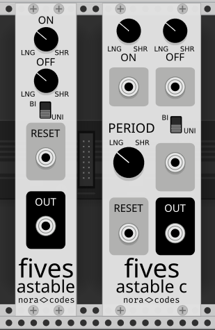
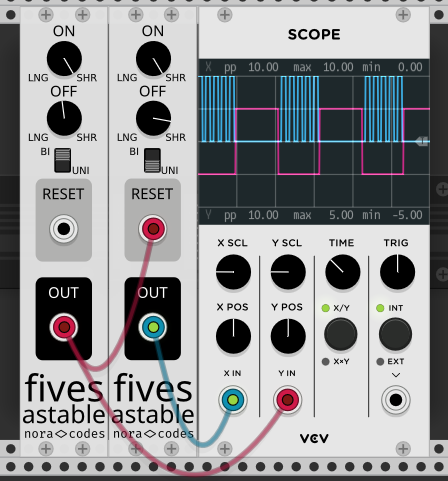
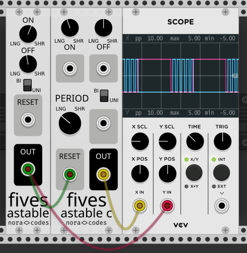

# Fives
## VCVRack modules by NoraCodes

**Fives** is a collection of modules based on the specified physical operation of the
world's most popular integrated circuit: the **LM555 multimode timer**.

### Why 555?

The 555 isn't generally used as an oscillator in modular instruments because, while it can
easily run in astable mode and generate a clean square wave with a variable duty cycle,
varying the frequency without changing the duty cycle requires a variable
capacitor, which are expensive and hard to integrate.

There is, of course, no such limitation in the world of VCVRack; variable caps are free and
never break down, and voltage-controlled variable capacitors are just as easy.

So, Fives provides modules that closely model what a real 555-based module would look like
as well as modules that apply the power of CV and impossibly accurate and fast variable
capacitors to the same mathematical model.

### Fives Astable

Fives Astable is a clock generator based on a physical model of the LM555 timer chip.
It has two knobs - ON and OFF - which control the high and low time of the oscillator,
and a RESET input which, when above 5 volts, kills the output.

The total period of oscillation is the on time plus the off time; there is no single
frequency control.

The 555 timer in Fives Astable is in a typical 555 astable configuration,
using a 100uF capacitor.
Each knob is modelled as a single 10k potentiometer with a small resistor in series.

### Fives Astable C

The Fives Astable C extends the slimmer, simpler Fives Astable with a variable capacitor
and CV inputs for the ON, OFF, and PERIOD inputs. The added PERIOD variable capacitor
ranges logarithmically from 10uF to 400uF.

CV applied to the inputs are scaled by the knob parameters.
Negative voltages are disregarded. 

